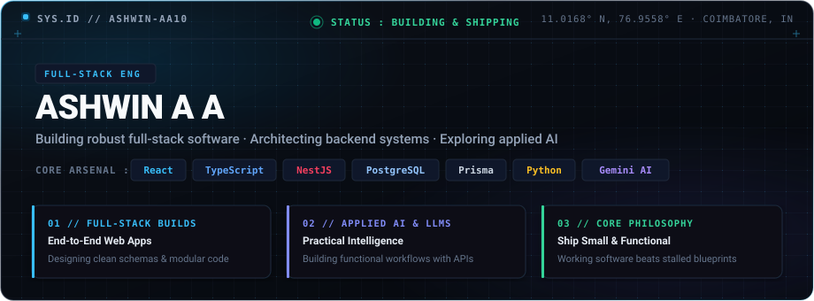
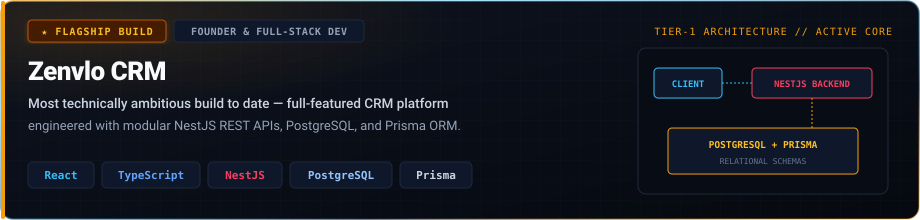
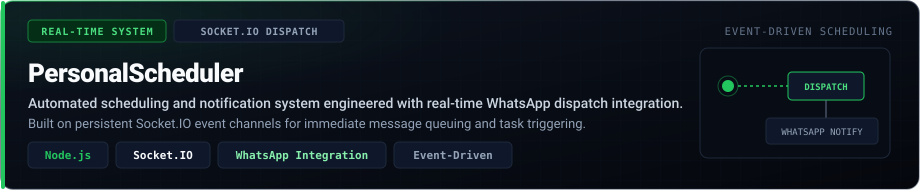
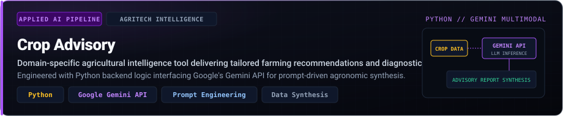
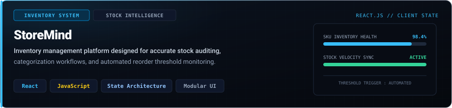
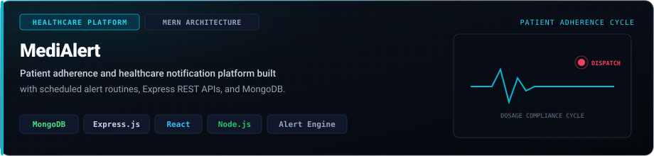
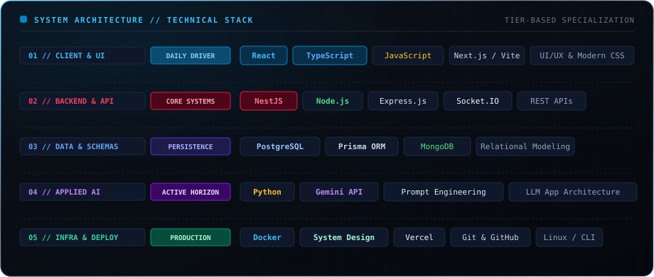
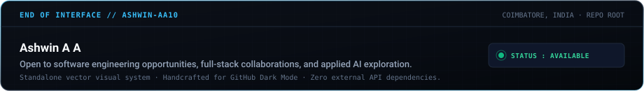

<div align="center">



<p align="center">
  <a href="https://ashwinaa.vercel.app"><b>PORTFOLIO</b></a> &nbsp;·&nbsp;
  <a href="https://www.linkedin.com/in/ashwinaa10/"><b>LINKEDIN</b></a> &nbsp;·&nbsp;
  <a href="https://github.com/AshwinAA10"><b>GITHUB</b></a> &nbsp;·&nbsp;
  <a href="mailto:ashwinaa2005@gmail.com"><b>EMAIL DIRECT</b></a>
</p>


</div>

### 01 // SELECTED BUILDS

A curated index of production applications, real-time systems, and applied AI tools built to solve concrete operational problems.

<br/>

<!-- Flagship: Zenvlo CRM -->
<a href="https://github.com/AshwinAA10">
  
</a>

<br/>
<br/>

<!-- PersonalScheduler -->
<a href="https://github.com/AshwinAA10/PersonalScheduler">
  
</a>

<br/>
<br/>

<!-- Crop Advisory -->
<a href="https://github.com/AshwinAA10/crop_advisory">
  
</a>

<br/>
<br/>

<!-- StoreMind -->
<a href="https://github.com/AshwinAA10/StoreMind">
  
</a>

<br/>
<br/>

<!-- MediAlert -->
<a href="https://github.com/AshwinAA10/MediAlert">
  
</a>

<br/>

<div align="center">
  
</div>

### 02 // SYSTEM ARCHITECTURE & TECHNICAL STACK

Technologies organized by runtime tier and actual application implementation. Daily drivers represent active production stacks; horizon technologies represent ongoing engineering depth.

<br/>

<div align="center">
  
</div>

<br/>

<div align="center">
  
</div>

### 03 // TRAJECTORY & CURRENT FOCUS

```
WHAT I HAVE BUILT
├── Full-stack web platforms with relational & document databases (PostgreSQL, MongoDB)
├── Modular API backends with NestJS and Express
├── Real-time event architectures using Socket.IO
└── Multimodal LLM integration pipelines (Gemini API + Python)

WHAT I AM ACTIVELY LEARNING
├── System Design & High-Throughput Backend Architecture (going beyond basic CRUD)
├── Dockerized microservices & production deployment reliability
└── Applied AI Engineering — building robust retrieval & context pipelines, not just API wrappers

WHAT I AM TARGETING NEXT
├── Shipping an end-to-end, production-grade full-stack platform independently
└── Meaningful contributions to production open-source software (merged PRs, real utility)
```

<div align="center">
  
</div>

### 04 // EDUCATION & CREDENTIALS

Compact overview of academic grounding, professional certifications, and industry research:

- **B.Sc Computer Science** — Bharathiar University *(CGPA 7.2)*
- **Full Stack Development (MERN)** — Amypo Technologies
- **Google Data Analytics** — Professional Certificate
- **AWS Cloud Technical Essentials** — Specialization
- **Oracle Cloud Databases** — Certified Specialist
- **MongoDB Certifications** — Associate Developer
- **UI/UX Design Specialization** — California Institute of the Arts (Coursera)
- **IRJET Published Research** — Published academic paper on SEO & profile optimization architectures
- **Industry Internship** — Seasana Industries / Machinery

<div align="center">
  
</div>

### 05 // OUTSIDE THE CODEBASE

When I'm away from the terminal:
- **Football** — Fast-paced tactical play, teamwork, and quick decision-making under pressure.
- **Trekking** — Exploring mountain trails, testing endurance, and finding mental clarity.
- **Travelling** — Experiencing unfamiliar terrain, regional cultures, and different perspectives.

> *"I would rather ship a compact, reliable system that works than get lost in endless blueprints for one that never launches. The craft is in turning intention into running software."*

<div align="center">
  
</div>

<div align="center">
  
</div>
