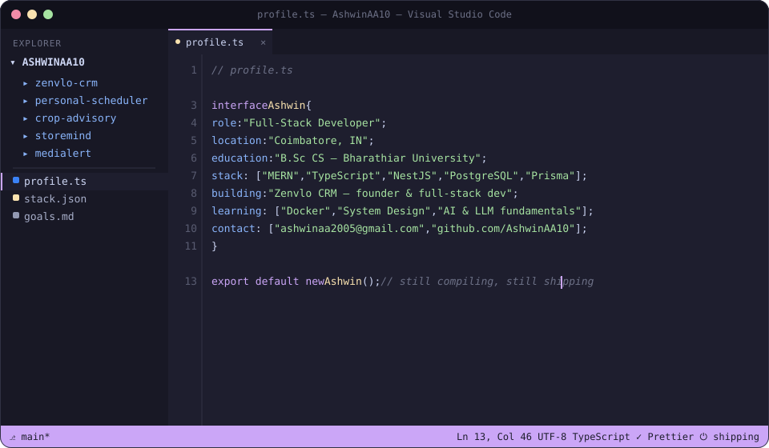

<p align="left">
  <a href="https://ashwinaa.vercel.app">Portfolio</a> ·
  <a href="https://www.linkedin.com/in/ashwinaa10/">LinkedIn</a> ·
  <a href="mailto:ashwinaa2005@gmail.com">Email</a>
</p>

---

### `$ git log --oneline --graph`

```
* 7f3a2c1 (HEAD -> main, founder) Zenvlo CRM
|         React · TypeScript · NestJS · PostgreSQL · Prisma
|         Most technically ambitious build so far — founder & full-stack dev.
|
* 9d1e04a PersonalScheduler
|         Real-time WhatsApp scheduling, built on Socket.IO.
|
* 4b7c88f crop_advisory
|         Python + Gemini API — advisory tool for agricultural use cases.
|
* 1a90bde StoreMind
|         Inventory management system. React + JavaScript.
|
* 6c2f1de MediAlert
|         Healthcare reminder system, full MERN stack.
|
* e5d0aa1 MovieMate-AI · World of Surya · pathfinding-visualizer
|         Recommendation engine, streaming UI, and a pathfinding algo
|         visualizer — three different ways of learning three different
|         things.
```

---

### `$ cat stack.lock`

```yaml
core:
  - MongoDB / Express.js / React.js / Node.js   # daily driver
  - TypeScript
  - NestJS
  - PostgreSQL + Prisma
deploy:
  - Vercel  # React / Next.js
learning:
  - Docker
  - System Design
  - AI & LLM fundamentals
```

No icon grid — if you want to know what I actually reach for, that's it.

---

### `$ cat credentials.log`

```
[✓] B.Sc Computer Science — Bharathiar University (CGPA 7.2)
[✓] Full Stack Development, MERN — Amypo Technologies
[✓] Google Data Analytics Professional Certificate
[✓] AWS Cloud Technical Essentials Specialization
[✓] Oracle Cloud Databases Certification
[✓] MongoDB Certifications
[✓] UI/UX Design Specialization — CalArts (Coursera)
[✓] IRJET research paper — published, SEO
[i] Internship — Seasana Industries/Machinery
```

---

### `$ cat TODO.md`

```
2026 GOALS
[ ] Ship a production-ready full-stack app, start to finish, alone
[ ] Contribute to open source — actually merged, not just forked
[ ] Learn AI application development, not just call an API and call it done
[ ] Master backend architecture — go deeper than "it works"
```

---

### `$ cat about.yaml`

```yaml
outside_of_code:
  - Football
  - Trekking
  - Travelling
philosophy: >
  I'd rather ship something small that works than plan something
  large that doesn't. Currently trying to get better at the reverse
  of that too.
```

---

<p align="left"><sub>
Last edited by hand, not by a badge generator. If you're reading this on GitHub, the code blocks above are the whole design — no external image dependencies, nothing that breaks when a third-party stats API goes down.
</sub></p>
