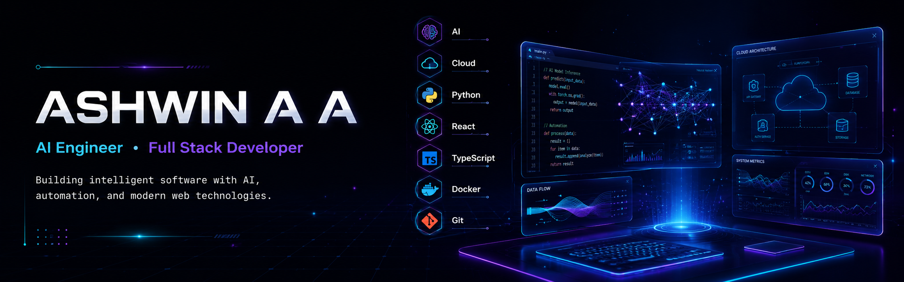

<div align="center">



# 👋 Hi, I'm Ashwin A A

### Computer Science Graduate • Full Stack Developer • Building Modern Web & AI Applications


<p>
<a href="https://www.linkedin.com/in/ashwinaa10/"></a>
<a href="https://ashwinaa.vercel.app"></a>
<a href="mailto:ashwinaa2005@gmail.com"></a>
<a href="https://github.com/AshwinAA10"></a>
</p>


</div>

---

# 💫 About Me

```yaml
Name: Ashwin A A

Education:
  B.Sc Computer Science
  Bharathiar University

Current Role:
  Full Stack Developer

Currently:
  Learning the MERN Stack
  Contributing to Zenvlo CRM

Interested In:
  - Full Stack Development
  - Artificial Intelligence
  - UI/UX Design
  - Cloud Technologies

Hobbies:
  - Football
  - Trekking
  - Travelling

Mission:
  Build software that solves real-world problems.
```

---

# 🛠 Tech Stack

<p align="center">

</p>

---

# 🚀 Featured Projects

| Project | Description | Stack |
|---|---|---|
| 📦 StoreMind | Inventory Management System | React, JavaScript |
| 💊 MediAlert | Healthcare reminder system | MERN |
| 🌐 World of Surya | Movie streaming website | HTML, CSS, JS |
| 🔍 Pathfinding Visualizer | Algorithm visualizer | React |
| 📊 Academic Profile Optimization | SEO-based profile optimization | React, Vite |

---

# 📊 GitHub Analytics

<p align="center">


</p>

<p align="center">

</p>

---

# 📈 Contribution Graph

<p align="center">

</p>

---

# 🏆 GitHub Trophies

<p align="center">

</p>

---

# 🌱 Currently Learning

- MERN Stack
- TypeScript
- AI & LLM Fundamentals
- System Design
- Docker

---

# 🎯 Goals for 2026

- Build production-ready full stack applications
- Contribute more to Open Source
- Learn AI application development
- Master backend architecture

---

<div align="center">

### ⭐ Thanks for visiting!

*"Building software that makes life a little easier, one commit at a time."*


</div>
